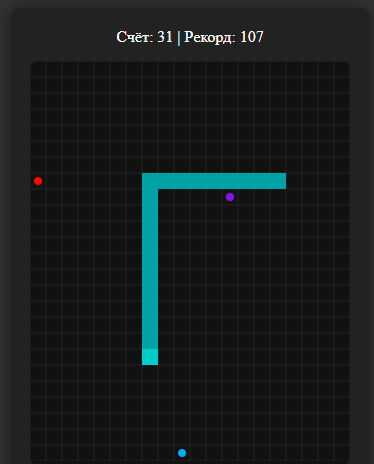

# Змейка с бонусами (Snake with Bonuses)

Классическая игра «Змейка» с дополнительными элементами: цветными ягодами, меняющими цвет змеи, и фиолетовыми ягодами, сокращающими длину тела.

 

## Особенности игры

- **Классическая механика змейки**: управление с клавиатуры, движение по сетке, рост при поедании ягод.
- **Три типа ягод**:
  - **Красная ягода** (стандартная): увеличивает длину змеи на 1 сегмент и даёт +1 очко.
  - **Синяя ягода**: меняет цвет головы и тела змеи на случайный, даёт +2 очка.
  - **Фиолетовая ягода**: сокращает длину змеи на 3–9 сегментов, временно ускоряет игру на 1 секунду, отнимает 3 очка (но не ниже 0).
- **Бесшовные границы**: змея проходит через край экрана и появляется с противоположной стороны.
- **Сохранение рекорда**: текущий рекорд сохраняется в `localStorage`.
- **Фоновая музыка**: музыкальное сопровождение с возможностью запуска по клику.
- **Визуальная сетка**: игровое поле разделено на ячейки для удобства ориентации.

## Как играть

1. Используйте клавиши **W, A, S, D** для управления направлением движения змеи:
   - **W** — вверх;
   - **A** — влево;
   - **S** — вниз;
   - **D** — вправо.
2. Собирайте ягоды, чтобы увеличить счёт и длину змеи.
3. Избегайте столкновения с собственным хвостом — это приведёт к перезапуску игры.
4. Следите за бонусами: синяя ягода меняет цвет, фиолетовая — сокращает длину и ускоряет игру.
5. Стремитесь побить свой рекорд!

## Как запустить игру

### Локальный запуск

1. Клонируйте репозиторий:
   ```bash
   git clone <URL-репозитория>
   ```
2. Перейдите в папку проекта:
   ```bash
    cd <навзание папки>
   ```
3. Откройте файл index.html

## Приятного геймплея!🐍
